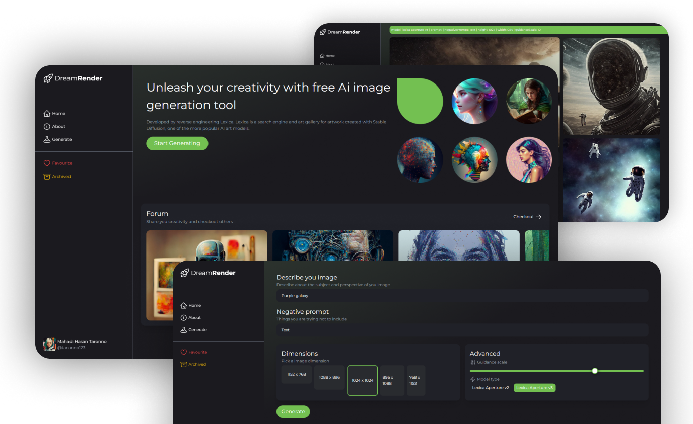

# DreamRender | Ai art generator using Lexica.ai API 

### Features
- Render Ai generated arts and images 
- Select multiple model parameters and generate
- Share generated images in the forum 
### A full-stack appilcation using:
- ReactJs NodeJs ExpressJs MongoDB
- Tailwindcss
- Lexica.ai 
